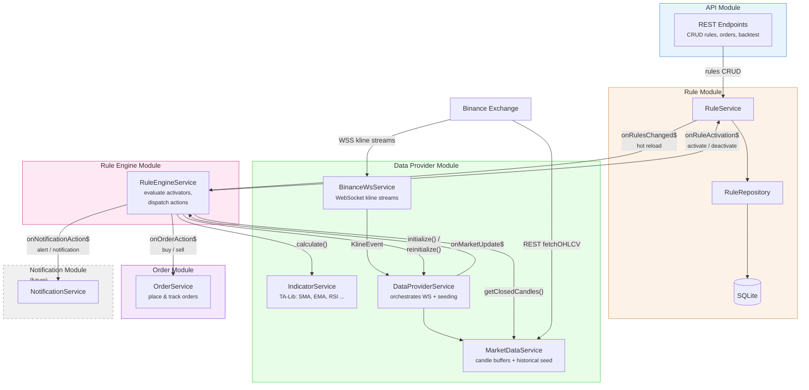
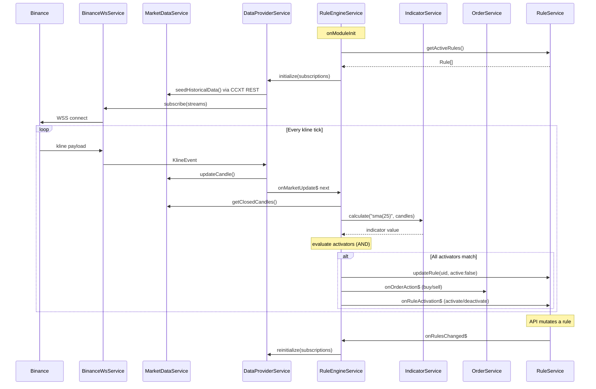

# Cryptocurrency tracker

## Roadmap

- [x] Ticker & worker implementation
- [x] Order manager integration
- [ ] Enhance logging & tracing functionality
- [ ] Rules API (CRUD endpoints, rule validation)
- [ ] Basic WebUI to manage the rules
- [ ] WebUI Authentication
- [ ] Notification service integration
- [ ] Broadcast logs onto WebUI


-----

thoughs

```
rule (db entity)
	- uid [int 6 digit]
	- active [bool] - rule engine only picks up the active rule. inactive rule are bounced
	- activatedAt [timestamp, nullable] - populated once the rule activated
	- pair [string] - the symbol of the crypto currency (e.g. SOL-USDT)
	- market [string] - the exchange name (e.g. binance)
	- frequency [int] - seconds delay to match the activators
	- activators_operator [enum: AND, OR]
	- activators [json] - the list of conditions which need to be matched to apply the actions
		Array<
			type: 'price' | string, // symbol price or indicator name
			side: 'lte' | 'gte',
			value: string,
			timeframe: 1m | 3m | 5m | 12m | 15m | 30m | 1h | 4h | 1d,
			
		}>
	- actions [json] - the list of actions applied once the activators 
		Array<{
			type: 'activate' | 'deactivate' | 'buy' | 'sell' | 'notification' | 'alert'
			context: <
				'activate' | 'deactivated' => {ruleUid: string}
				'buy' | 'sell' => {
					type: 'limit' | 'market',
					price: string,
					quantity: {
						type: 'fixed' | 'percent',
						value: string
					}
				}
				'notification' | 'alert' => { channel: 'telegram' }
			>
		}>
	- deadlines
```

## Architecture



### Data pipeline

